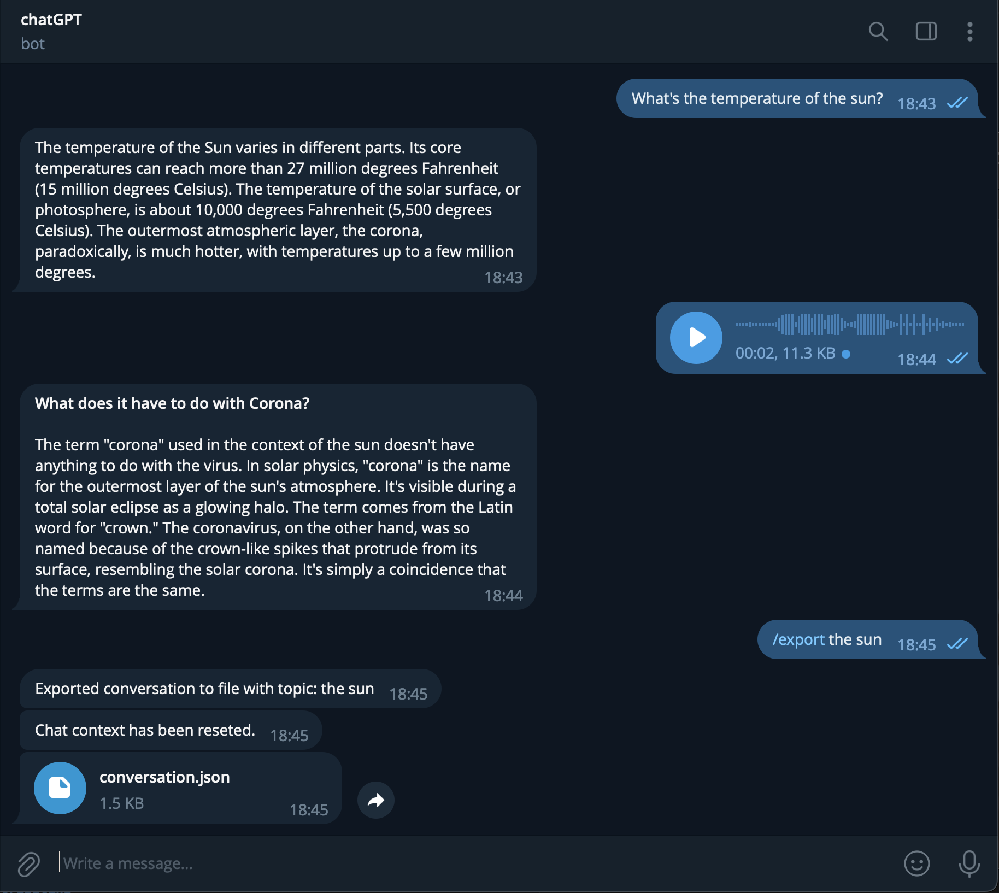

# Telegram GPT Chatbot

This is a Telegram chatbot that uses the OpenAI GPT-4 API to generate responses to user messages. It also has the ability to transcribe and respond to voice messages using the Whisper API.

You can use the following Action Commands in the Telegram chat:
* `/reset`: The bot will forget the conversation history
* `/export`: Exports the current conversation into downlodable JSON file. You can specify the topic by just writing it after the /export command to save it int the JSON. Automatically calls /reset


## Getting Started

To use this bot, you'll need to create a Telegram bot and obtain an API key. You can find more information [here](https://core.telegram.org/bots/tutorial) or talk to the BotFather. You'll also need to sign up for an OpenAI API key to use the chatGPT and the Whisper API.

Once you have your API keys, you can add them to the appropriate files in the [`keys`](/keys) directory.

### Setup
```bash
$ conda create --n telegram-bot python=3.11.4 pip
$ conda activate telegram-bot
$ pip install -r requirements.txt
```

### Usage

To start the bot, run the `telegram_bot.py` script. The bot will listen for incoming messages and respond with generated text from the OpenAI GPT-4 API.

To ask a question using a voice message, record a voice message and send it to the bot. The bot will transcribe the message using the Whisper API and generate a response using the OpenAI GPT-4 API.




**conversation.json**

```json
[
    {
        "role": "user",
        "content": "What's the temperature of the sun?"
    },
    {
        "role": "assistant",
        "content": "...."
    },
    {
        "role": "user",
        "content": "What does it have to do with Corona?"
    },
    {
        "role": "assistant",
        "content": "..."
    },
    {
        "topic": "the sun"
    }
]
```

## Run it on a RaspberryPi

The chatbot can easily be deployed on a RaspberryPi to run the bot 24/7.

```bash
$ python3 -m venv ~/telegram-bot
$ source ~/telegram-bot/bin/activate
$ pip3 install -r requirements.txt
```

```bash
$ python3 telegram_bot.py
```

## Contributing

If you'd like to contribute to this project, feel free to submit a pull request. Please make sure to follow the existing code style and include tests for any new functionality.

## License

This project is licensed under the MIT License. See the `LICENSE` file for details.